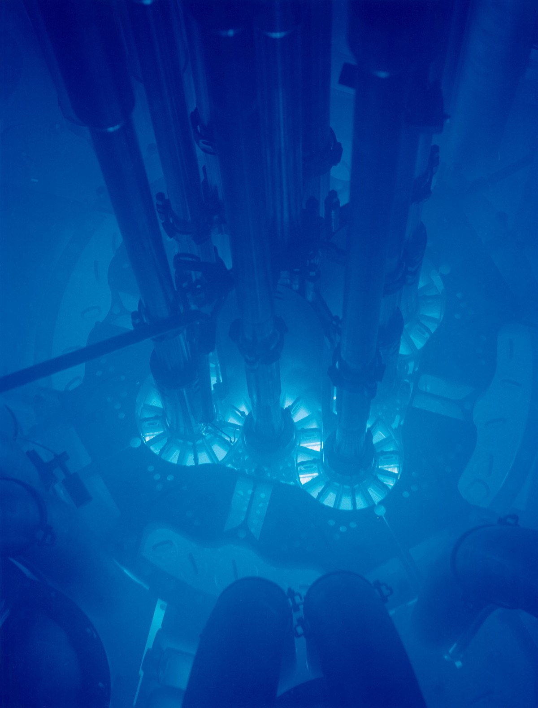

# Project 1

Here is a cool picture of the Cherenkov Radiation in the Advanced Test Reactor in Idaho:
<p align="center">
  
</p>

Cherenkov Radiation can occur if a charged partice with some velocity  enters a material with refractive index . The speed of light in this material is /, and if is value is less than , then the particle will emit light, called as Cherenkov radiation. The angle of radiation emission is directly related to the relative speeds:

<p align="center">

</p>

You can get the Cherenkov angle  this with Python with the following code:

```
import numpy as np

thetac = lambda v, n: np.arccos((2.998*(10**8))/(n*v))
```

This assumes a velocity in \[m/s], and returns a value in radians. In the picture above, beta particles (electrons) are escaping the reactor and producing Cherenkov radiation in the water, producing the glow. 
